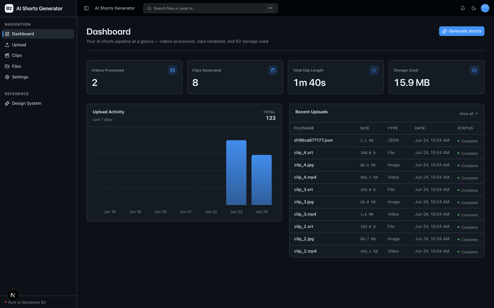
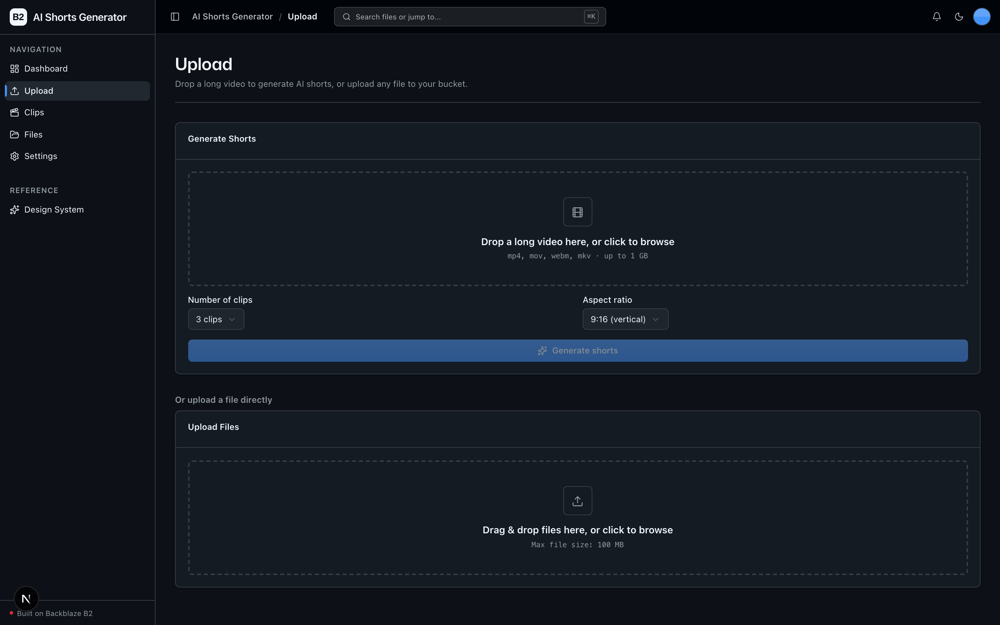
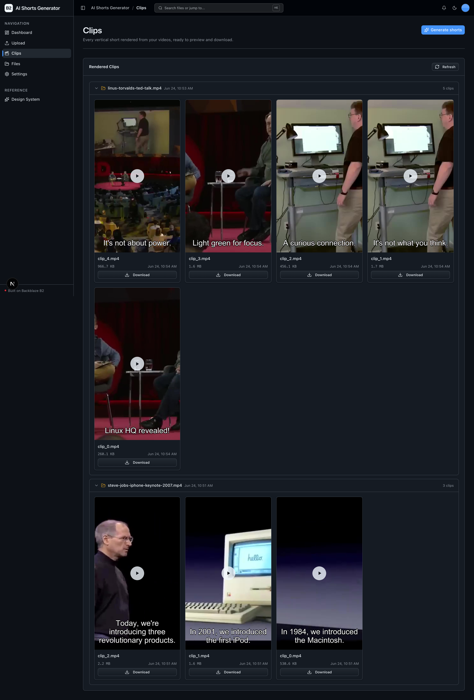
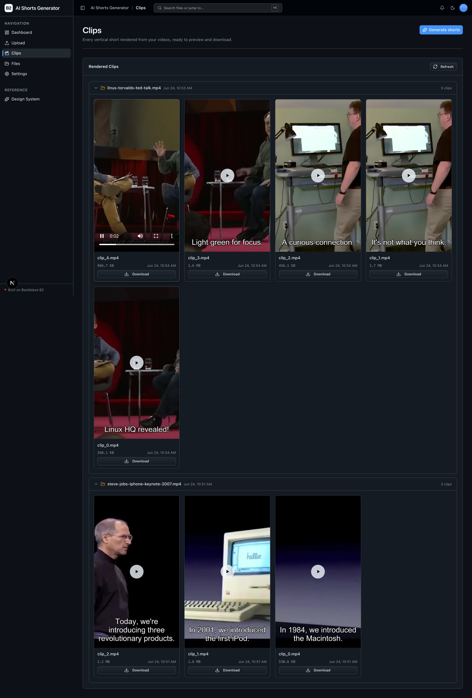

<!-- last_verified: 2026-06-23 -->
# AI Shorts Generator

Turn one long video into a batch of share-ready vertical shorts. Upload a podcast, lecture, or webinar; the app transcribes it, uses an LLM to pick the most engaging moments, and renders **9:16 clips with burned-in captions** — every source video, transcript, caption track, and rendered clip persisted on **[Backblaze B2](https://www.backblaze.com/sign-up/ai-cloud-storage?utm_source=github&utm_medium=referral&utm_campaign=ai_artifacts&utm_content=b2ai-ai-shorts-generator)** cloud storage. It's an open-source take on the "Opus Clip" workflow: upload once, generate many clips, download forever.

## What it looks like

**Dashboard** — videos processed, clips generated, total clip length, and B2 storage used, with a 7-day upload-activity chart and a recent-uploads table.



**Upload** — drop a long video to generate AI shorts (choose clip count and aspect ratio), or upload any file straight to your B2 bucket.



**Clips** — every rendered 9:16 short grouped into a folder per source video, each with a first-frame poster and a download button.



**Clip preview** — click any short to play it inline in a 9:16 player without leaving the library.



**What you get out of the box:**
- Upload a long video and watch it flow through transcribe → moment-scoring → clip render as a tracked job
- AI moment detection + caption generation via the **Genblaze SDK** (`gpt-4o-mini`, one OpenAI key)
- Local, keyless transcription by default (`faster-whisper`), or the OpenAI Whisper API as a one-flag switch
- Vertical (9:16) clips with burned-in captions, rendered with ffmpeg
- A full B2-backed file browser, upload UI, and dashboard
- Agent-optimized docs — your AI coding agent can read the repo and start contributing immediately

## How it works

```
long video ──▶ upload to B2 ──▶ transcribe ──▶ score moments ──▶ render vertical clips ──▶ store on B2
                (source)        (faster-whisper   (gpt-4o-mini via   (ffmpeg, 9:16,          (clips +
                                 or Whisper API)   genblaze-openai)    burned-in captions)     captions)
```

1. **Upload.** The source video lands in your B2 bucket via the S3-compatible API.
2. **Transcribe.** `faster-whisper` runs locally and keyless by default; set `TRANSCRIPTION_BACKEND=openai` to use the hosted Whisper API instead (it reuses your one OpenAI key).
3. **Score moments.** The transcript is sent to `gpt-4o-mini` through `genblaze-openai`, which ranks the most engaging, self-contained segments and writes caption text for each.
4. **Render.** Each selected moment is cut to a vertical 9:16 clip with burned-in captions (ffmpeg).
5. **Persist.** Source, transcript, caption tracks, and finished clips all live in B2 — upload once, download the clips as many times as you like.

This is a textbook B2 workload: source videos are large, every clip and caption track accumulates, and the read/write loop is sustained — exactly the kind of data-heavy AI workflow B2 is the cost-effective storage layer for.

> **Why OpenAI and not Claude?** The core moment-scoring + caption step is provider-agnostic, routed through the Genblaze SDK. Genblaze ships no Anthropic/Claude provider today, so this sample uses the next supported provider, OpenAI (`gpt-4o-mini`). Swap providers by changing the `repo/moments.py` adapter and `SHORTS_MODEL` — the rest of the app is untouched.

## Quick Start

You need: Node.js >= 20, pnpm >= 9, Python >= 3.11, `ffmpeg` on your PATH, a free **[Backblaze B2 account](https://www.backblaze.com/sign-up/ai-cloud-storage?utm_source=github&utm_medium=referral&utm_campaign=ai_artifacts&utm_content=b2ai-ai-shorts-generator)**, and an OpenAI API key.

**1. Clone and install**

```bash
git clone https://github.com/backblaze-b2-samples/ai-shorts-generator.git
cd ai-shorts-generator
pnpm install
```

**2. Set up the backend**

```bash
cd services/api
python -m venv .venv && source .venv/bin/activate
pip install -r requirements.txt
cd ../..
```

**3. Add your credentials**

```bash
cp .env.example .env
```

Open `.env` and fill it in. From the [Backblaze B2 dashboard](https://secure.backblaze.com/b2_buckets.htm?utm_source=github&utm_medium=referral&utm_campaign=ai_artifacts&utm_content=b2ai-ai-shorts-generator):

1. **Create a bucket** → put its name in `B2_BUCKET_NAME`, and set `B2_REGION` to the bucket's region (e.g. `us-west-004`). The S3 endpoint is derived from the region automatically.
2. **Create an application key** with `Read and Write` permission. B2 shows two values:
   - **keyID** → `B2_APPLICATION_KEY_ID`
   - **applicationKey** → `B2_APPLICATION_KEY` *(only shown once — paste it now)*
3. Add your **`OPENAI_API_KEY`** (the app's one external AI key — used for moment-scoring and, optionally, transcription).

> Want a walkthrough? See the docs for [creating a bucket](https://www.backblaze.com/docs/cloud-storage-create-and-manage-buckets) and [creating app keys](https://www.backblaze.com/docs/cloud-storage-create-and-manage-app-keys).

**4. Run it**

```bash
pnpm dev
```

Frontend at `localhost:3000`, API at `localhost:8000`. Upload a video and watch the clips come out.

`pnpm dev` runs `pnpm doctor` first — a preflight check that catches the common setup gotchas (wrong Node/Python version, missing venv, missing or placeholder `.env`, ports already taken) and tells you exactly how to fix each one. Run it standalone any time with `pnpm doctor`.

## Configuration

All configuration lives in a single root `.env` (validated at startup, so misconfig fails fast). The shorts-specific knobs:

| Variable | Default | What it does |
|----------|---------|--------------|
| `SHORTS_MODEL` | `gpt-4o-mini` | OpenAI model used to score moments and write captions |
| `TRANSCRIPTION_BACKEND` | `local` | `local` = keyless `faster-whisper`; `openai` = hosted Whisper API |
| `WHISPER_MODEL` | `base.en` | Whisper model size for local transcription |
| `CLIPS_PER_VIDEO` | `3` | How many clips to generate per source video |
| `CLIP_ASPECT` | `9:16` | Output aspect ratio for rendered clips |

## Core Features

- **Shorts pipeline** — upload → transcribe → score → render, tracked as a job with status you can poll
- [File Upload](docs/features/file-upload.md) — drag-and-drop upload with real-time progress
- [File Browser](docs/features/file-browser.md) — list, preview, download, delete source videos and clips
- [Dashboard](docs/features/dashboard.md) — clips generated, videos processed, recent activity
- [Metadata Extraction](docs/features/metadata-extraction.md) — dimensions, duration, checksums
- [Design System](docs/design-system.md) — tokens, primitives, the blaze generating loader, and inline `ErrorState` / `EmptyState` patterns. Live preview at `/design`.
- Single-source config — one `.env` powers both API and web app, validated at startup
- Centralized data layer — every fetch goes through TanStack Query hooks in `apps/web/src/lib/queries.ts`
- Structural tests — verify layering rules, import boundaries, SDK containment, file size limits
- `/health` (B2 connectivity check) and `/metrics` (Prometheus counters) endpoints

## Tech Stack

- TypeScript, Next.js 16, React 19, Tailwind v4, shadcn/ui, Recharts
- TanStack Query — caching, dedup, retry for every fetch
- Python 3.11+, FastAPI, Pydantic v2, boto3
- **Genblaze SDK** (`genblaze-openai`) — provider-wrapped LLM access for moment-scoring + captions
- `faster-whisper` for local transcription, `ffmpeg` for clip rendering
- Backblaze B2 (S3-compatible object storage)
- pnpm workspaces (monorepo)

## Architecture

This repo is optimized for coding agents, and architecture is enforced mechanically — not by convention.

**[AGENTS.md](AGENTS.md) is the single source of truth for all coding agents.** It gives the repository layout, architectural invariants, commands, and conventions; agent-specific files (CLAUDE.md, etc.) are thin pointers back to it.

The backend follows a strict layered architecture — `types -> config -> repo -> service -> runtime` — with import boundaries, file-size limits, and SDK containment (all `boto3`, `genblaze`, and Whisper calls live only in `repo/`) verified by structural tests that run on every change. When rules are enforceable by code, agents follow them reliably.

```
apps/web/          Next.js 16 frontend (App Router, Tailwind v4, shadcn/ui)
services/api/      FastAPI backend (layered: types/config/repo/service/runtime)
packages/shared/   Shared TypeScript types
docs/              System of record (features, workflows, security, reliability)
infra/railway/     Deployment config
```

## Commands

| Command | What it does |
|---------|-------------|
| `pnpm dev` | Start frontend + backend |
| `pnpm dev:web` | Frontend only |
| `pnpm dev:api` | Backend only |
| `pnpm build` | Build frontend |
| `pnpm lint` | Lint frontend |
| `pnpm lint:api` | Lint backend (ruff) |
| `pnpm test:api` | Run backend tests |
| `pnpm check:structure` | Verify layering rules |
| `pnpm test:e2e` | Playwright e2e tests (run `pnpm --filter @ai-shorts-generator/web exec playwright install chromium` once first) |

## Documentation Map

| Doc | Purpose |
|-----|---------|
| [AGENTS.md](AGENTS.md) | Agent table of contents — start here |
| [ARCHITECTURE.md](ARCHITECTURE.md) | System layout, layering, data flows |
| [docs/features/](docs/features/) | Feature docs (upload, browser, dashboard, metadata) |
| [docs/design-system.md](docs/design-system.md) | Design tokens, primitives, loader, error/empty states |
| [docs/app-workflows.md](docs/app-workflows.md) | User journeys |
| [docs/dev-workflows.md](docs/dev-workflows.md) | Engineering workflows and testing |
| [docs/SECURITY.md](docs/SECURITY.md) | Security principles |
| [docs/RELIABILITY.md](docs/RELIABILITY.md) | Reliability expectations |

## License

MIT License - see [LICENSE](LICENSE) for details.

## Claude Agent B2 Skill

Manage Backblaze B2 from your terminal using natural language (list/search, audits, stale or large file detection, security checks, safe cleanup).

Repo: [https://github.com/backblaze-b2-samples/claude-skill-b2-cloud-storage](https://github.com/backblaze-b2-samples/claude-skill-b2-cloud-storage)
